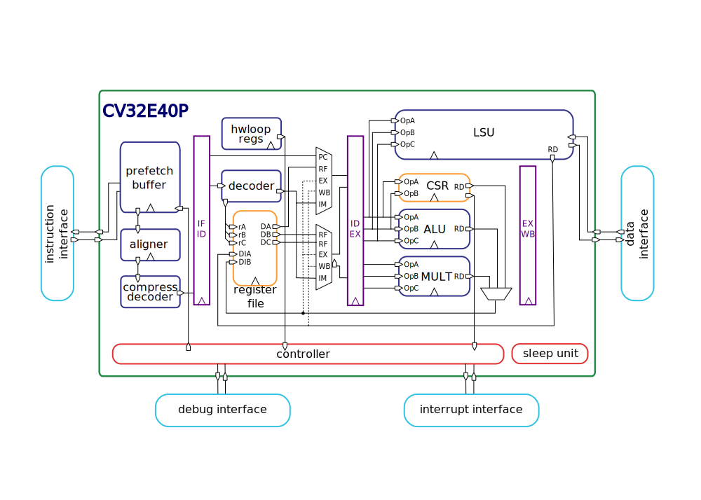

# OpenHW Group CORE-V CV32E40P RISC-V IP

CV32E40P is a small and efficient, 32-bit, in-order RISC-V core with a 4-stage pipeline that implements
the RV32IM\[F|Zfinx\]C instruction set architecture, and the PULP custom extensions for achieving
higher code density, performance, and energy efficiency \[[1](https://doi.org/10.1109/TVLSI.2017.2654506)\], \[[2](https://doi.org/10.1109/PATMOS.2017.8106976)\].
It started its life as a fork of the OR10N CPU core that is based on the OpenRISC ISA.
Then, under the name of RI5CY, it became a RISC-V core (2016), and it has been maintained
by the [PULP platform](https://www.pulp-platform.org/) team until February 2020,
when it has been contributed to [OpenHW Group](https://www.openhwgroup.org/).

## Documentation

The CV32E40P user manual can be found in the _docs_ folder and it is
captured in reStructuredText, rendered to html using [Sphinx](https://docs.readthedocs.io/en/stable/intro/getting-started-with-sphinx.html).
These documents are viewable using readthedocs and can be viewed [here](https://docs.openhwgroup.org/projects/cv32e40p-user-manual/).

## Verification
The verification environment for the CV32E40P is _not_ in this Repository.  There is a small, simple testbench here which is
useful for experimentation only and should not be used to validate any changes to the RTL prior to pushing to the master
branch of this repo.

The verification environment for this core as well as other cores in the OpenHW Group CORE-V family is at the
[core-v-verif](https://github.com/openhwgroup/core-v-verif) repository on GitHub.

The Makefiles supported in the **core-v-verif** project automatically clone the appropriate version of the **cv32e40p**  RTL sources.

## Changelog

A changelog is generated automatically in the documentation from the individual pull requests.
In order to enable automatic changelog generation within the CV32E40P documentation, the committer is required to label each pull request
that touches any file in 'rtl' (or any of its subdirectories) with *Component:RTL* and label each pull request that touches any file in
'docs' (or any of its subdirectories) with *Component:Doc*. Pull requests that are not labeled or labeled with *ignore-for-release* are
ignored for the changelog generation.

Only the person who actually performs the merge can add these labels (you need committer rights). The changelog flow only works if at most
1 label is applied and therefore pull requests that touches both RTL and documentation files in the same pull request are not allowed.

## Constraints
Example synthesis constraints for the CV32E40P are provided.

## Contributing

We highly appreciate community contributions. We are currently using the lowRISC contribution guide.
To ease our work of reviewing your contributions,
please:

* Create your own fork to commit your changes and then open a Pull Request to the **dev** branch.
* Split large contributions into smaller commits addressing individual changes or bug fixes. Do not
  mix unrelated changes into the same commit!
* Do not mix updates within the 'rtl' directory with updates within the 'docs' directory ino the same pull request.
* Write meaningful commit messages. For more information, please check out the [the Ibex contribution
  guide](https://github.com/lowrisc/ibex/blob/master/CONTRIBUTING.md).
* If asked to modify your changes, do fixup your commits and rebase your branch to maintain a
  clean history.
* If the PR gets accepted and merged into the the **dev** branch, an action is triggered automatically to check whether the changes are logically equivalent to the frozen RTL on a given set of parameters. If the changes are logically equivalent, the **dev** branch is automatically merged into the **master** branch. Otherwise, we need to investigate manually. If a bug is found, thus the changes are not logically equivalent, we follow the procedure documented [here](https://docs.openhwgroup.org/projects/cv32e40p-user-manual/core_versions.html). 

For more details on how this is implemented, have a look at this [page](https://github.com/openhwgroup/cv32e40p/blob/master/.github/workflows/aws_cv32e40p.md).

When contributing SystemVerilog source code, please try to be consistent and adhere to [the lowRISC Verilog
coding style guide](https://github.com/lowRISC/style-guides/blob/master/VerilogCodingStyle.md).

To get started, please check out the ["Good First Issue"
 list](https://github.com/openhwgroup/cv32e40p/issues?q=is%3Aissue+is%3Aopen+-label%3Astatus%3Aresolved+label%3A%22good+first+issue%22).

The RTL code has been formatted with ["Verible"](https://github.com/google/verible) v0.0-1149-g7eae750.
Run `./util/format-verible` to format all the files.

## Issues and Troubleshooting

If you find any problems or issues with CV32E40P or the documentation, please check out the [issue
 tracker](https://github.com/openhwgroup/cv32e40p/issues) and create a new issue if your problem is
not yet tracked.

## References

1. [Gautschi, Michael, et al. "Near-Threshold RISC-V Core With DSP Extensions for Scalable IoT Endpoint Devices."
 in IEEE Transactions on Very Large Scale Integration (VLSI) Systems, vol. 25, no. 10, pp. 2700-2713, Oct. 2017](https://doi.org/10.1109/TVLSI.2017.2654506)

2. [Schiavone, Pasquale Davide, et al. "Slow and steady wins the race? A comparison of
 ultra-low-power RISC-V cores for Internet-of-Things applications."
 _27th International Symposium on Power and Timing Modeling, Optimization and Simulation
 (PATMOS 2017)_](https://doi.org/10.1109/PATMOS.2017.8106976)

