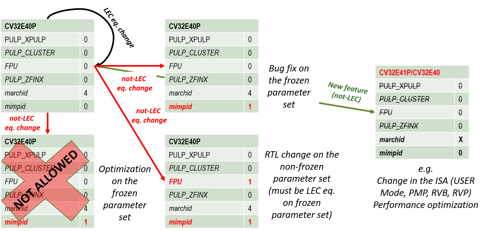

..
   Copyright (c) 2020 OpenHW Group
   
   Licensed under the Solderpad Hardware Licence, Version 2.0 (the "License");
   you may not use this file except in compliance with the License.
   You may obtain a copy of the License at
  
   https://solderpad.org/licenses/
  
   Unless required by applicable law or agreed to in writing, software
   distributed under the License is distributed on an "AS IS" BASIS,
   WITHOUT WARRANTIES OR CONDITIONS OF ANY KIND, either express or implied.
   See the License for the specific language governing permissions and
   limitations under the License.
  
   SPDX-License-Identifier: Apache-2.0 WITH SHL-2.0

.. _core_versions:

Core Versions and RTL Freeze Rules
==================================

The CV32E40P is defined by the ``marchid`` and ``mimpid`` tuple.
The tuple identify which sets of parameters have been verified
by OpenHW Group, and once RTL Freeze is achieved, no further
non-logically equivalent changes are allowed on that set of parameters.

The RTL Freeze version of the core is indentified by a GitHub
tag with the format cv32e40p_vMAJOR.MINOR.PATCH (e.g. cv32e40p_v1.0.0).
In addition, the release date is reported in the documentation.

What happens after RTL Freeze?
------------------------------

RTL changes on verified parameters
^^^^^^^^^^^^^^^^^^^^^^^^^^^^^^^^^^^^

Minor changes to the RTL on a frozen parameter set (e.g., nicer RTL code, clearer RTL code, etc) are allowed if, and only if, they are logically equivalent to the frozen (tagged) version of the core.
This is guaranteed by a CI flow that checks that pull requests are logically equivalent to a specific tag of the core as 
explained `here <https://github.com/openhwgroup/cv32e40p/blob/master/.github/workflows/aws_cv32e40p.md>`_.
For example, suppose we re-write "better" a portion of the ALU that affects the frozen set of parameters of the version cv32e40p_v1.0.0, 
for instance, the adder. In that case, the proposed changes are compared with the code based on cv32e40p_v1.0.0, and if they are logically equivalent, they are accepted. Otherwise, they are rejected. See below for more case scenarios.

A bug is found
^^^^^^^^^^^^^^

If a bug is found that affect the already frozen parameter set,
the RTL changes required to fix such bug are non-logically equivalent by definition.
Therefore, the RTL changes are applied only on a different  ``mimpid``
value and the bug and the fix must be documented.
These changes are visible by software as the ``mimpid`` has a different value.
Every bug or set of bugs found must be followed by another RTL Freeze release and a new GitHub tag.

RTL changes on non-verified yet parameters
^^^^^^^^^^^^^^^^^^^^^^^^^^^^^^^^^^^^^^^^^^

If changes affecting the core on a non-frozen parameter set are required,
as for example, to fix bugs found in the communication to the FPU (e.g., affecting the core only if ``FPU=1``),
or to change the ISA Extensions decoding of PULP instructions (e.g., affecting the core only if ``PULP_XPULP=1``),
then such changes must remain logically equivalent for the already frozen set of parameters (except for the required ``mimpid`` update), and they must be applied on a different ``mimpid`` value. They can be non-logically equivalent to a non-frozen set of parameters.
These changes are visible by software as the ``mimpid`` has a different value.
Once the new set of parameters is verified and achieved the sign-off for RTL freeze,
a new GitHub tag and version of the core is released.

PPA optimizations and new features
^^^^^^^^^^^^^^^^^^^^^^^^^^^^^^^^^^

Non-logically equivalent PPA optimizations and new features are not allowed on a given set
of RTL frozen parameters (e.g., a faster divider).
If PPA optimizations are logically-equivalent instead, they can be applied without
changing the ``mimpid`` value (as such changes are not visible in software).
However, a new GitHub tag should be release and changes documented.

:numref:`rtl_freeze_rules` shows the aforementioned rules.

   Versions control of CV32E40P

.. _backward_compatibility:

Non-backward compatibility
--------------------------

For cv32e40p_v2.0.0, some modifications have been done on ``cv32e40p_top`` and ``cv32e40p_core`` parameters names.

It is worth mentioning that if the core in its v1 version was/is instantiated without parameters setting, backward compatibility is still correct as all parameters default values are set to v1 values.

Parameters
^^^^^^^^^^

As RTL has been updated to fully support ratified RISC-V Zfinx, old PULP_ZFINX parameter has been renamed ZFINX in all design and verification files.

To differentiate v1 to v2 encoding of PULP instructions, old PULP_XPULP and PULP_CLUSTER parameters have been renamed COREV_PULP and COREV_CLUSTER in all design and verification files.

To easily change FPU instructions latencies, 2 new parameters have been added, FPU_ADDMUL_LAT for Addition/Multiplication lane and FPU_OTHERS_LAT for the other instructions (move, conversion, comparison...).

Released core versions
----------------------

The verified parameter sets of the core, their implementation version, GitHub tags, and dates are reported here.

cv32e40p_v1.0.0
^^^^^^^^^^^^^^^

+--------------------+-------------------+------------+--------------------+---------+
| Git Tag            | Tagged By         | Date       | Reason for Release | Comment |
+====================+===================+============+====================+=========+
| cv32e40p_v1.0.0    | Arjan Bink        | 2020-12-10 | RTL Freeze         |         |
+--------------------+-------------------+------------+--------------------+---------+

For this release ``mimpid`` value is fixed and is equal to ``0``.

It refers to the CV32E40P core verified with the following parameters:

+---------------------------+-------+
| Name                      | Value |
+===========================+=======+
| ``FPU``                   |   0   |
+---------------------------+-------+
| ``PULP_ZFINX``            |   0   |
+---------------------------+-------+
| ``PULP_XPULP``            |   0   |
+---------------------------+-------+
| ``PULP_CLUSTER``          |   0   |
+---------------------------+-------+

Verification of cv32e40p_v1.0.0 has been done with only following value for ``NUM_MHPMCOUNTERS`` parameter: ``NUM_MHPMCOUNTERS`` == 1.

The list of open (waived) issues at the time of applying the cv32e40p_v1.0.0 tag can be found at:

* https://github.com/openhwgroup/programs/blob/7a72508c90484a7835590a97038eb9dd53bd8c32/milestones/CV32E40P/RTL_Freeze_v1.0.0/Design_openissues.md
* https://github.com/openhwgroup/programs/blob/7a72508c90484a7835590a97038eb9dd53bd8c32/milestones/CV32E40P/RTL_Freeze_v1.0.0/Verification_openissues.md
* https://github.com/openhwgroup/programs/blob/7a72508c90484a7835590a97038eb9dd53bd8c32/milestones/CV32E40P/RTL_Freeze_v1.0.0/Documentation_openissues.md

cv32e40p_v2.0.0
^^^^^^^^^^^^^^^

+--------------------+-------------------+------------+--------------------+---------+
| Git Tag            | Tagged By         | Date       | Reason for Release | Comment |
+====================+===================+============+====================+=========+
| cv32e40p_v2.0.0    |                   |            | RTL Freeze         |         |
+--------------------+-------------------+------------+--------------------+---------+

For this release ``mimpid`` value is depending of parameters value.

mimpid = 0
~~~~~~~~~~

When parameters are set with the exact same values than for cv32e40p_v1.0.0 release then ``mimpid`` value is equal to ``0``.

+---------------------------+-------+
| Name                      | Value |
+===========================+=======+
| ``FPU``                   |   0   |
+---------------------------+-------+
| ``ZFINX``                 |   0   |
+---------------------------+-------+
| ``COREV_PULP``            |   0   |
+---------------------------+-------+
| ``COREV_CLUSTER``         |   0   |
+---------------------------+-------+

mimpid = 1
~~~~~~~~~~

When one parameter is set with a different value than for cv32e40p_v1.0.0 release then ``mimpid`` value is equal to ``1``.

This means either ``FPU``, ``COREV_PULP`` or ``COREV_CLUSTER`` is set to 1.

.. The list of open (waived) issues at the time of applying the cv32e40p_v1.0.0 tag can be found at:
  
  * https://github.com/openhwgroup/programs/blob/7a72508c90484a7835590a97038eb9dd53bd8c32/milestones/CV32E40P/RTL_Freeze_v1.0.0/Design_openissues.md
  * https://github.com/openhwgroup/programs/blob/7a72508c90484a7835590a97038eb9dd53bd8c32/milestones/CV32E40P/RTL_Freeze_v1.0.0/Verification_openissues.md
  * https://github.com/openhwgroup/programs/blob/7a72508c90484a7835590a97038eb9dd53bd8c32/milestones/CV32E40P/RTL_Freeze_v1.0.0/Documentation_openissues.md
