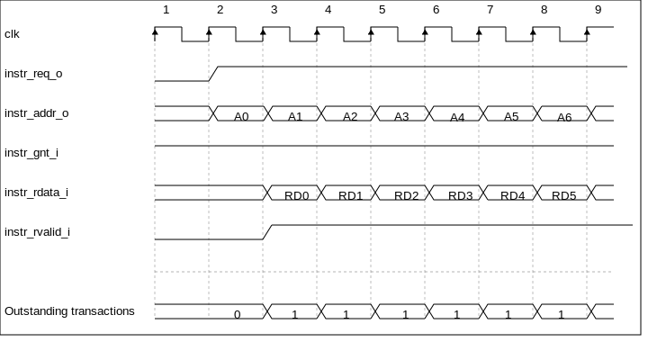

..
   Copyright (c) 2020 OpenHW Group
   
   Licensed under the Solderpad Hardware Licence, Version 2.0 (the "License");
   you may not use this file except in compliance with the License.
   You may obtain a copy of the License at
  
   https://solderpad.org/licenses/
  
   Unless required by applicable law or agreed to in writing, software
   distributed under the License is distributed on an "AS IS" BASIS,
   WITHOUT WARRANTIES OR CONDITIONS OF ANY KIND, either express or implied.
   See the License for the specific language governing permissions and
   limitations under the License.
  
   SPDX-License-Identifier: Apache-2.0 WITH SHL-2.0

.. _instruction-fetch:

Instruction Fetch
=================

The Instruction Fetch (IF) stage of the CV32E40P is able to supply one instruction to
the Instruction Decode (ID ) stage per cycle if the external bus interface is able
to serve one instruction per cycle. In case of executing compressed instructions,
on average less than one 32-bit instruction fetch will we needed per instruction
in the ID stage.

For optimal performance and timing closure reasons, a prefetcher is used
which fetches instructions via the external bus interface from for example
an externally connected instruction memory or instruction cache.

The prefetch unit performs word-aligned 32-bit prefetches and stores the
fetched words in a FIFO with four entries. As a result of this (speculative)
prefetch, CV32E40P can fetch up to four words outside of the code region
and care should therefore be taken that no unwanted read side effects occur
for such prefetches outside of the actual code region.

:numref:`Instruction Fetch interface signals` describes the signals that are used to fetch instructions. This
interface is a simplified version of the interface that is used by the
LSU, which is described in :ref:`load-store-unit`. The difference is that no writes
are possible and thus it needs fewer signals.

.. table:: Instruction Fetch interface signals
  :name: Instruction Fetch interface signals

  +-------------------------+-----------------+--------------------------------------------------------------------------------------------------------------------------------+
  | **Signal**              | **Direction**   | **Description**                                                                                                                |
  +-------------------------+-----------------+--------------------------------------------------------------------------------------------------------------------------------+
  | instr\_req\_o           | output          | Request valid, will stay high until instr\_gnt\_i is high for one cycle                                                        |
  +-------------------------+-----------------+--------------------------------------------------------------------------------------------------------------------------------+
  | instr\_addr\_o[31:0]    | output          | Address, word aligned                                                                                                          |
  +-------------------------+-----------------+--------------------------------------------------------------------------------------------------------------------------------+
  | instr\_rdata\_i[31:0]   | input           | Data read from memory                                                                                                          |
  +-------------------------+-----------------+--------------------------------------------------------------------------------------------------------------------------------+
  | instr\_rvalid\_i        | input           | instr\_rdata\_i holds valid data when instr\_rvalid\_i is high. This signal will be high for exactly one cycle per request.    |
  +-------------------------+-----------------+--------------------------------------------------------------------------------------------------------------------------------+
  | instr\_gnt\_i           | input           | The other side accepted the request. instr\_addr\_o may change in the next cycle.                                              |
  +-------------------------+-----------------+--------------------------------------------------------------------------------------------------------------------------------+

Misaligned Accesses
-------------------

Externally, the IF interface performs word-aligned instruction fetches only.
Misaligned instruction fetches are handled by performing two separate word-aligned instruction fetches.
Internally, the core can deal with both word- and half-word-aligned instruction addresses to support compressed instructions.
The LSB of the instruction address is ignored internally.

Protocol
--------

The instruction bus interface is compliant to the OBI (Open Bus Interface) protocol.
See https://github.com/openhwgroup/core-v-docs/blob/master/cores/cv32e40p/OBI-v1.0.pdf
for details about the protocol. The CV32E40P instruction fetch interface does not
implement the following optional OBI signals: we, be, wdata, auser, wuser, aid,
rready, err, ruser, rid. These signals can be thought of as being tied off as
specified in the OBI specification. The CV32E40P instruction fetch interface can
cause up to two outstanding transactions.

:numref:`obi-instruction-basic` and :numref:`obi-instruction-multiple-outstanding` show example timing diagrams of the protocol.

   Back-to-back Memory Transactions

.. figure:: ../images/obi_instruction_multiple_outstanding.svg
   :name: obi-instruction-multiple-outstanding
   :align: center
   :alt:

   Multiple Outstanding Memory Transactions
