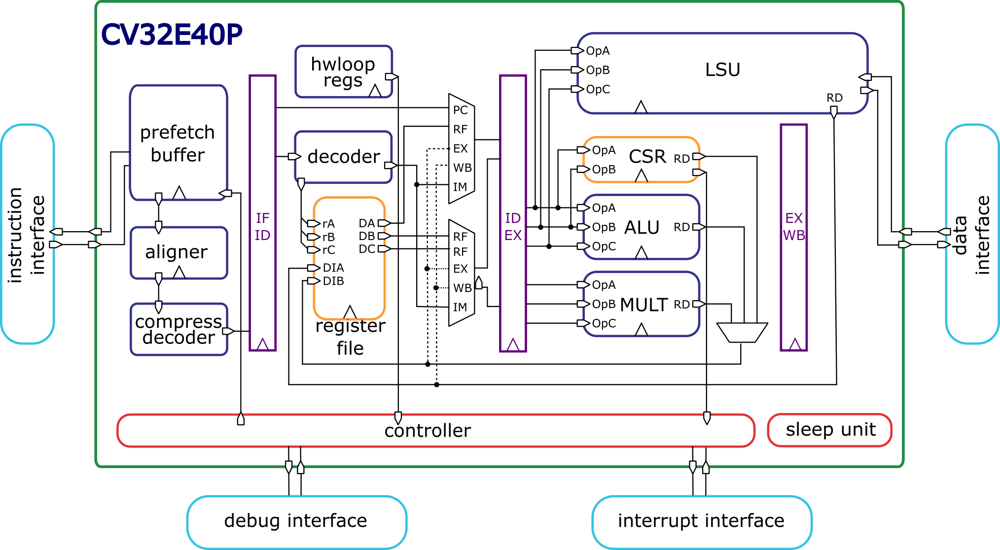

..
   Copyright (c) 2023 OpenHW Group

   Licensed under the Solderpad Hardware Licence, Version 2.0 (the "License");
   you may not use this file except in compliance with the License.
   You may obtain a copy of the License at

   https://solderpad.org/licenses/

   Unless required by applicable law or agreed to in writing, software
   distributed under the License is distributed on an "AS IS" BASIS,
   WITHOUT WARRANTIES OR CONDITIONS OF ANY KIND, either express or implied.
   See the License for the specific language governing permissions and
   limitations under the License.

   SPDX-License-Identifier: Apache-2.0 WITH SHL-2.0

Introduction
=============

CV32E40P is a 4-stage in-order 32-bit RISC-V
processor core. The ISA of CV32E40P
has been extended to support multiple additional instructions including
hardware loops, post-increment load and store instructions,
additional ALU instructions and SIMD instructions that are not part of the standard RISC-V
ISA. :numref:`blockdiagram` shows a block diagram of the top level with the core and the FPU.

   Block Diagram of CV32E40P RISC-V Core

License
-------
Copyright 2023 OpenHW Group.

Copyright 2018 ETH Zurich and University of Bologna.

Copyright and related rights are licensed under the Solderpad Hardware
License, Version 0.51 (the “License”); you may not use this file except
in compliance with the License. You may obtain a copy of the License at
http://solderpad.org/licenses/SHL-0.51. Unless required by applicable
law or agreed to in writing, software, hardware and materials
distributed under this License is distributed on an “AS IS” BASIS,
WITHOUT WARRANTIES OR CONDITIONS OF ANY KIND, either express or implied.
See the License for the specific language governing permissions and
limitations under the License.

Bus Interfaces
--------------

The Instruction Fetch and Load/Store data bus interfaces are compliant to the **OBI** (Open Bus Interface) protocol.
See `OBI-v1.2.pdf <https://raw.githubusercontent.com/openhwgroup/obi/188c87089975a59c56338949f5c187c1f8841332/OBI-v1.2.pdf>`_ for details about the protocol.
Additional information can be found in the :ref:`instruction-fetch` and :ref:`load-store-unit` chapters of this document.

Standards Compliance
--------------------

CV32E40P is a standards-compliant 32-bit RISC-V processor.
It follows these specifications:

* `RISC-V Instruction Set Manual, Volume I: User-Level ISA, Document Version 20191213 (December 13, 2019) <https://github.com/riscv/riscv-isa-manual/releases/download/Ratified-IMAFDQC/riscv-spec-20191213.pdf>`_
* `RISC-V Instruction Set Manual, Volume II: Privileged Architecture, document version 20190608-Base-Ratified (June 8, 2019) <https://github.com/riscv/riscv-isa-manual/releases/download/Ratified-IMFDQC-and-Priv-v1.11/riscv-privileged-20190608.pdf>`_. CV32E40P implements the Machine ISA version 1.11.
* `RISC-V External Debug Support, draft version 0.13.2 <https://github.com/riscv/riscv-debug-spec/raw/release/riscv-debug-release.pdf>`_

Many features in the RISC-V specification are optional, and CV32E40P can be parameterized to enable or disable some of them.

CV32E40P supports the following base integer instruction set.

* The RV32I Base Integer Instruction Set, version 2.1

In addition, the following standard instruction set extensions are available.

.. list-table:: CV32E40P Standard Instruction Set Extensions
   :header-rows: 1
   :widths: 55 12 33
   :class: no-scrollbar-table

   * - **Standard Extension**
     - **Version**
     - **Configurability**

   * - **C**: Standard Extension for Compressed Instructions
     - 2.0
     - always enabled

   * - **M**: Standard Extension for Integer Multiplication and Division
     - 2.0
     - always enabled

   * - **Zicntr**: Performance Counters
     - 2.0
     - always enabled

   * - **Zicsr**: Control and Status Register Instructions
     - 2.0
     - always enabled

   * - **Zifencei**: Instruction-Fetch Fence
     - 2.0
     - always enabled

   * - **F**: Single-Precision Floating-Point using F registers
     - 2.2
     - optionally enabled with the ``FPU`` parameter

   * - **Zfinx**: Single-Precision Floating-Point using X registers
     - 1.0
     - optionally enabled with the ``ZFINX`` parameter (also requires the ``FPU`` parameter)

The following custom instruction set extensions are available.

.. list-table:: CV32E40P Custom Instruction Set Extensions
   :header-rows: 1
   :widths: 40 12 48
   :class: no-scrollbar-table

   * - **Custom Extension**
     - **Version**
     - **Configurability**

   * - **Xcv**: CORE-V PULP ISA Extensions
     - 1.0
     - optionally enabled with the ``COREV_PULP`` parameter

   * - **Xcvelw**: CORE-V PULP Cluster ISA Extension
     - 1.0
     - optionally enabled with the ``COREV_CLUSTER`` parameter

Most content of the RISC-V privileged specification is optional.
CV32E40P currently supports the following features according to the RISC-V Privileged Specification, version 1.11.

* M-Mode
* All CSRs listed in :ref:`cs-registers`
* Hardware Performance Counters as described in :ref:`performance-counters` controlled by the ``NUM_MHPMCOUNTERS`` parameter
* Trap handling supporting direct mode or vectored mode as described at :ref:`exceptions-interrupts`

Contents
--------

 * :ref:`core-integration` provides the instantiation template and gives descriptions of the design parameters as well as the input and output ports. It gives synthesis guidelines as well, especially with respect to the Floating-Point Unit.
 * :ref:`fpu` describes the Floating Point Unit (FPU).
 * :ref:`verification` gives a brief overview of the verification methodology.
 * :ref:`hwloop-specs` describes the PULP Hardware Loop extension.
 * :ref:`custom-isa-extensions` describes the custom instruction set extensions.
 * :ref:`performance-counters` gives an overview of the performance monitors and event counters available in CV32E40P.
 * The control and status registers are explained in :ref:`cs-registers`.
 * :ref:`exceptions-interrupts` deals with the infrastructure for handling exceptions and interrupts.
 * :ref:`debug-support` gives a brief overview on the debug infrastructure.
 * :ref:`pipeline-details` described the overal pipeline structure.
 * The instruction and data interfaces of CV32E40P are explained in :ref:`instruction-fetch` and :ref:`load-store-unit`, respectively.
 * The register-file is described in :ref:`register-file`.
 * :ref:`sleep_unit` describes the Sleep unit including the PULP Cluster extension.
 * :ref:`core_versions` describes the core versioning.
 * :ref:`glossary` provides definitions of used terminology.

History
-------

CV32E40P started its life as a fork of the OR10N CPU core based on the OpenRISC ISA. Then, under the name of RI5CY, it became a RISC-V core (2016),
and it has been maintained by the PULP platform <https://pulp-platform.org> team until February 2020, when it has been contributed to OpenHW Group https://www.openhwgroup.org.

As RI5CY has been used in several projects, a list of all the changes made by OpenHW Group since February 2020 follows:

Memory-Protocol
^^^^^^^^^^^^^^^

The Instruction and Data memory interfaces are now compliant with the OBI protocol (see `OBI-v1.2.pdf <https://raw.githubusercontent.com/openhwgroup/obi/188c87089975a59c56338949f5c187c1f8841332/OBI-v1.2.pdf>`_).
Such memory interface is slightly different from the one used by RI5CY as: the grant signal can now be kept high by the bus even without the core raising a request; and the request signal does not depend anymore on the rvalid signal (no combinatorial dependency). The OBI is easier to be interfaced to the AMBA AXI and AHB protocols and improves timing as it removes rvalid->req dependency. Also, the protocol forces the address stability. Thus, the core can not retract memory requests once issued, nor can it change the issued address (as was the case for the RI5CY instruction memory interface).

RV32F Extensions
^^^^^^^^^^^^^^^^

Previously, RI5CY could select with a parameter whether the FPU was instantiated inside the EX stage or via the APU interface. Now in CV32E40P, the FPU is not instantiated in the core EX stage anymore.
A new file called cv32e40p_top.sv is instantiating the core together with the FPU and APU interface is not visible on I/Os.
This is this new top level which has been used for Verification and Implementation.

RV32A Extensions, Security and Memory Protection
^^^^^^^^^^^^^^^^^^^^^^^^^^^^^^^^^^^^^^^^^^^^^^^^

CV32E40P core does not support the RV32A (atomic) extensions, the U-mode, and the PMP anymore.
Most of the previous RTL descriptions of these features have been kept but not maintained. The RTL code has been partially kept to allow previous users of these features to develop their own by reusing previously developed RI5CY modules.

CSR Address Re-Mapping
^^^^^^^^^^^^^^^^^^^^^^

RI5CY used to have custom performance counters 32b wide (not compliant with RISC-V) in the CSR address space {0x7A0, 0x7A1, 0x780-0x79F}.
CV32E40P is now fully compliant with the RISC-V spec on performance counters side.
And the custom PULP HWLoop CSRs have been moved from the 0x7C* to RISC-V user custom read-only 0xCC0-0xCFF address space.

Interrupts
^^^^^^^^^^

RI5CY used to have a req plus a 5 bits ID interrupt interface, supporting up to 32 interrupt requests (only one active at a time), with the priority defined outside in an interrupt controller. CV32E40P is now compliant with the CLINT RISC-V spec, extended with 16 custom interrupts lines called fast, for a total of 19 interrupt lines. They can be all active simultaneously, and priority and per-request interrupt enable bit is controlled by the core CLINT definition.

PULP HWLoop Spec
^^^^^^^^^^^^^^^^

RI5CY supported two nested HWLoops. Every loop had a minimum of two instructions. The start and end of the loop addresses
could be misaligned, and the instructions in the loop body could be of any kind. CV32E40P has a more restricted constraints for the HWLoop (see  :ref:`hwloop-specs`).

Compliancy, bug fixing, code clean-up, and documentation
^^^^^^^^^^^^^^^^^^^^^^^^^^^^^^^^^^^^^^^^^^^^^^^^^^^^^^^^

The CV32E40P has been verified. It is fully compliant with RISC-V (RI5CY was partially compliant). Many bugs have been fixed, and the RTL code cleaned-up. The documentation has been formatted with reStructuredText and has been developed following at industrial quality level.

References
----------

1. `Gautschi, Michael, et al. "Near-Threshold RISC-V Core With DSP Extensions for Scalable IoT Endpoint Devices." in IEEE Transactions on Very Large Scale Integration (VLSI) Systems, vol. 25, no. 10, pp. 2700-2713, Oct. 2017 <https://ieeexplore.ieee.org/document/7864441>`_

2. `Schiavone, Pasquale Davide, et al. "Slow and steady wins the race? A comparison of ultra-low-power RISC-V cores for Internet-of-Things applications." 27th International Symposium on Power and Timing Modeling, Optimization and Simulation (PATMOS 2017) <https://doi.org/10.1109/PATMOS.2017.8106976>`_

Contributors
------------

| Andreas Traber (`atraber@iis.ee.ethz.ch <mailto:atraber@iis.ee.ethz.ch>`__)
| Michael Gautschi (`gautschi@iis.ee.ethz.ch <mailto:gautschi@iis.ee.ethz.ch>`__)
| Pasquale Davide Schiavone (`pschiavo@iis.ee.ethz.ch <mailto:pschiavo@iis.ee.ethz.ch>`__)

| Arjan Bink (`arjan.bink@silabs.com <mailto:arjan.bink@silabs.com>`__)
| Paul Zavalney (`paul.zavalney@silabs.com <mailto:paul.zavalney@silabs.com>`__)

| Pascal Gouédo (`pascal.gouedo@dolphin.fr <mailto:pascal.gouedo@dolphin.fr>`__)

| Micrel Lab and Multitherman Lab
| University of Bologna, Italy

| Integrated Systems Lab
| ETH Zürich, Switzerland

