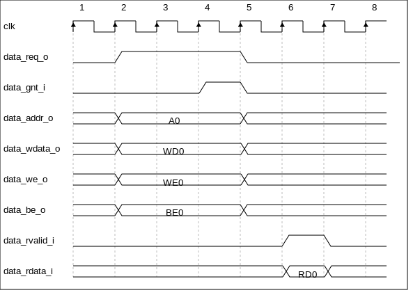

..
   Copyright (c) 2023 OpenHW Group
   
   Licensed under the Solderpad Hardware Licence, Version 2.0 (the "License");
   you may not use this file except in compliance with the License.
   You may obtain a copy of the License at
  
   https://solderpad.org/licenses/
  
   Unless required by applicable law or agreed to in writing, software
   distributed under the License is distributed on an "AS IS" BASIS,
   WITHOUT WARRANTIES OR CONDITIONS OF ANY KIND, either express or implied.
   See the License for the specific language governing permissions and
   limitations under the License.
  
   SPDX-License-Identifier: Apache-2.0 WITH SHL-2.0

.. _load-store-unit:

Load-Store-Unit (LSU)
=====================

The Load-Store Unit (LSU) of the core takes care of accessing the data memory. Load and
stores on words (32 bit), half words (16 bit) and bytes (8 bit) are
supported. The CV32E40P data interface can cause up to 2 outstanding
transactions and there is no FIFO to allow more outstanding requests.

:numref:`LSU interface signals` describes the signals that are used by the LSU.

.. table:: LSU interface signals
  :name: LSU interface signals
  :widths: 25 15 60
  :class: no-scrollbar-table

  +------------------------+-----------------+------------------------------------------------------------------------------------------------------------------------------+
  | **Signal**             | **Direction**   | **Description**                                                                                                              |
  +------------------------+-----------------+------------------------------------------------------------------------------------------------------------------------------+
  | ``data_addr_o[31:0]``  | output          | Address                                                                                                                      |
  +------------------------+-----------------+------------------------------------------------------------------------------------------------------------------------------+
  | ``data_req_o``         | output          | Request valid, will stay high until ``data_gnt_i`` is high for one cycle                                                     |
  +------------------------+-----------------+------------------------------------------------------------------------------------------------------------------------------+
  | ``data_gnt_i``         | input           | The other side accepted the request. ``data_addr_o`` may change in the next cycle.                                           |
  +------------------------+-----------------+------------------------------------------------------------------------------------------------------------------------------+
  | ``data_we_o``          | output          | Write Enable, high for writes, low for reads. Sent together with ``data_req_o``                                              |
  +------------------------+-----------------+------------------------------------------------------------------------------------------------------------------------------+
  | ``data_be_o[3:0]``     | output          | Byte Enable. Is set for the bytes to write/read, sent together with ``data_req_o``                                           |
  +------------------------+-----------------+------------------------------------------------------------------------------------------------------------------------------+
  | ``data_wdata_o[31:0]`` | output          | Data to be written to memory, sent together with ``data_req_o``                                                              |
  +------------------------+-----------------+------------------------------------------------------------------------------------------------------------------------------+
  | ``data_rvalid_i``      | input           | ``data_rvalid_i`` will be high for exactly one cycle to signal the end of the response phase of for both read and write      |
  |                        |                 | transactions. For a read transaction ``data_rdata_i`` holds valid data when ``data_rvalid_i`` is high.                       |
  +------------------------+-----------------+------------------------------------------------------------------------------------------------------------------------------+
  | ``data_rdata_i[31:0]`` | input           | Data read from memory                                                                                                        |
  +------------------------+-----------------+------------------------------------------------------------------------------------------------------------------------------+

Misaligned Accesses
-------------------

The LSU never raises address-misaligned exceptions. For loads and stores where the effective address is not naturally aligned to the referenced 
datatype (i.e., on a four-byte boundary for word accesses, and a two-byte boundary for halfword accesses) the load/store is performed as two
bus transactions in case that the data item crosses a word boundary. A single load/store instruction is therefore performed as two bus
transactions for the following scenarios:

* Load/store of a word for a non-word-aligned address
* Load/store of a halfword crossing a word address boundary

In both cases the transfer corresponding to the lowest address is performed first. All other scenarios can be handled with a single bus transaction.

Protocol
--------

The CV32E40P data interface does not implement the following optional OBI signals: auser, wuser, aid, rready, err, ruser, rid.
These signals can be thought of as being tied off as specified in the OBI specification.

.. note::

  **Transactions Ordering**
  As mentioned above, data interface can generate up to 2 outstanding transactions.
  OBI specification states that links are always in-order from master point of view. So as the data interface does not generate transaction id (aid),
  interconnect infrastructure should ensure that transaction responses come back in the same order they were sent by adding its own additional information.

The OBI protocol that is used by the LSU to communicate with a memory works
as follows.

The LSU provides a valid address on ``data_addr_o``, control information
on ``data_we_o``, ``data_be_o`` (as well as write data on ``data_wdata_o`` in
case of a store) and sets ``data_req_o`` high. The memory sets ``data_gnt_i``
high as soon as it is ready to serve the request. This may happen at any
time, even before the request was sent. After a request has been granted
the address phase signals (``data_addr_o``, ``data_we_o``, ``data_be_o`` and
``data_wdata_o``) may be changed in the next cycle by the LSU as the memory
is assumed to already have processed and stored that information. After
granting a request, the memory answers with a ``data_rvalid_i`` set high
if ``data_rdata_i`` is valid. This may happen one or more cycles after the
request has been granted. Note that ``data_rvalid_i`` must also be set high
to signal the end of the response phase for a write transaction (although
the ``data_rdata_i`` has no meaning in that case). When multiple granted requests 
are outstanding, it is assumed that the memory requests will be kept in-order and
one ``data_rvalid_i`` will be signalled for each of them, in the order they were issued.

:numref:`obi-data-basic`, :numref:`obi-data-back-to-back`, :numref:`obi-data-slow-response` and
:numref:`obi-data-multiple-outstanding` show example timing diagrams of the protocol.

.. figure:: ../images/obi_data_basic.svg
   :name: obi-data-basic
   :align: center
   :alt:

   Basic Memory Transaction

.. figure:: ../images/obi_data_back_to_back.svg
   :name: obi-data-back-to-back
   :align: center
   :alt:

   Back-to-back Memory Transactions

   Slow Response Memory Transaction

.. figure:: ../images/obi_data_multiple_outstanding.svg
   :name: obi-data-multiple-outstanding
   :align: center
   :alt:

   Multiple Outstanding Memory Transactions

Post-Incrementing Load and Store Instructions
---------------------------------------------

This section is only valid if ``COREV_PULP = 1``

Post-incrementing load and store instructions perform a load/store
operation from/to the data memory while at the same time increasing the
base address by the specified offset. For the memory access, the base
address without offset is used.

Post-incrementing load and stores reduce the number of required
instructions to execute code with regular data access patterns, which
can typically be found in loops. These post-incrementing load/store
instructions allow the address increment to be embedded in the memory
access instructions and get rid of separate instructions to handle
pointers. Coupled with hardware loop extension, these instructions allow
to reduce the loop overhead significantly.

.. only:: PMP

  Physical Memory Protection (PMP) Unit
  -------------------------------------

  The CV32E40P core has a PMP module which can be enabled by setting the
  parameter PULP_SECURE=1 which also enabled the core to possibly run in
  USER MODE. Such unit has a configurable number of entries (up to 16) and
  supports all the modes as TOR, NAPOT and NA4. Every fetch, load and
  store access executed in USER MODE are first filtered by the PMP unit
  which can possibly generated exceptions. For the moment, the MPRV bit in
  MSTATUS as well as the LOCK mechanism in the PMP are not supported.
