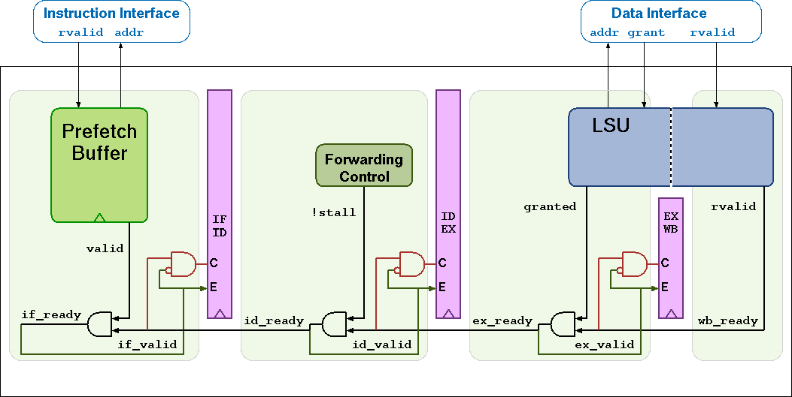

..
   Copyright (c) 2020 OpenHW Group
   
   Licensed under the Solderpad Hardware Licence, Version 2.0 (the "License");
   you may not use this file except in compliance with the License.
   You may obtain a copy of the License at
  
   https://solderpad.org/licenses/
  
   Unless required by applicable law or agreed to in writing, software
   distributed under the License is distributed on an "AS IS" BASIS,
   WITHOUT WARRANTIES OR CONDITIONS OF ANY KIND, either express or implied.
   See the License for the specific language governing permissions and
   limitations under the License.
  
   SPDX-License-Identifier: Apache-2.0 WITH SHL-2.0

.. _pipeline-details:

   CV32E40P Pipeline

Pipeline Details
================

CV32E40P has a 4-stage in-order completion pipeline, the 4 stages are:

Instruction Fetch (IF)
  Fetches instructions from memory via an aligning prefetch buffer, capable of fetching 1 instruction per cycle if the instruction side memory system allows. The IF stage also pre-decodes RVC instructions into RV32I base instructions. See :ref:`instruction-fetch` for details.

Instruction Decode (ID)
  Decodes fetched instruction and performs required registerfile reads. Jumps are taken from the ID stage.

Execute (EX)
  Executes the instructions. The EX stage contains the ALU, Multiplier and Divider. Branches (with their condition met) are taken from the EX stage. Multi-cycle instructions will stall this stage until they are complete. The ALU, Multiplier and Divider instructions write back their result to the register file from the EX stage. The address generation part of the load-store-unit (LSU) is contained in EX as well.

Writeback (WB)
  Writes the result of Load instructions back to the register file.

Multi- and Single-Cycle Instructions
------------------------------------

:numref:`Cycle counts per instruction type` shows the cycle count per instruction type. Some instructions have a variable time, this is indicated as a range e.g. 1..32 means
that the instruction takes a minimum of 1 cycle and a maximum of 32 cycles. The cycle counts assume zero stall on the instruction-side interface
and zero stall on the data-side memory interface.

.. table:: Cycle counts per instruction type
  :name: Cycle counts per instruction type

  +-----------------------+--------------------------------------+-------------------------------------------------------------+
  |   Instruction Type    |                 Cycles               |                         Description                         |
  +=======================+======================================+=============================================================+
  | Integer Computational | 1                                    | Integer Computational Instructions are defined in the       |
  |                       |                                      | RISCV-V RV32I Base Integer Instruction Set.                 |
  +-----------------------+--------------------------------------+-------------------------------------------------------------+
  | CSR Access            | 4 (mstatus, mepc, mtvec, mcause,     | CSR Access Instruction are defined in 'Zicsr' of the        |
  |                       | mcycle, minstret, mhpmcounter*,      | RISC-V specification.                                       |
  |                       | mcycleh, minstreth, mhpmcounter*h,   |                                                             |
  |                       | mcountinhibit, mhpmevent*, dscr,     |                                                             |
  |                       | dpc, dscratch0, dscratch1, privlv)   |                                                             |
  |                       |                                      |                                                             |
  |                       | 1 (all the other CSRs)               |                                                             |
  +-----------------------+--------------------------------------+-------------------------------------------------------------+
  | Load/Store            | 1                                    | Load/Store is handled in 1 bus transaction using both EX    |
  |                       |                                      | and WB stages for 1 cycle each. For misaligned word         |
  |                       | 2 (non-word aligned word             | transfers and for halfword transfers that cross a word      |
  |                       | transfer)                            | boundary 2 bus transactions are performed using EX and WB   |
  |                       |                                      | stages for 2 cycles each.                                   |
  |                       | 2 (halfword transfer crossing        | A **cv.elw** takes 4 cycles.                                |
  |                       | word boundary)                       |                                                             |
  |                       |                                      |                                                             |
  |                       | 4 (cv.elw)                           |                                                             |
  +-----------------------+--------------------------------------+-------------------------------------------------------------+
  | Multiplication        | 1 (mul)                              | CV32E40P uses a single-cycle 32-bit x 32-bit multiplier     |
  |                       |                                      | with a 32-bit result. The multiplications with upper-word   |
  |                       | 5 (mulh, mulhsu, mulhu)              | result take 5 cycles to compute.                            |
  +-----------------------+--------------------------------------+-------------------------------------------------------------+
  | Division              | 3 - 35                               | The number of cycles depends on the divider operand value   |
  |                       |                                      | (operand b), i.e. in the number of leading bits at 0.       |
  | Remainder             | 3 - 35                               | The minimum number of cycles is 3 when the divider has zero |
  |                       |                                      | leading bits at 0 (e.g., 0x8000000).                        |
  |                       |                                      | The maximum number of cycles is 35 when the divider is 0    |
  +-----------------------+--------------------------------------+-------------------------------------------------------------+
  | Jump                  | 2                                    | Jumps are performed in the ID stage. Upon a jump the IF     |
  |                       |                                      | stage (including prefetch buffer) is flushed. The new PC    |
  |                       | 3 (target is a non-word-aligned      | request will appear on the instruction-side memory          |
  |                       | non-RVC instruction)                 | interface the same cycle the jump instruction is in the ID  |
  |                       |                                      | stage.                                                      |
  +-----------------------+--------------------------------------+-------------------------------------------------------------+
  | Branch (Not-Taken)    | 1                                    | Any branch where the condition is not met will              |
  |                       |                                      | not stall.                                                  |
  +-----------------------+--------------------------------------+-------------------------------------------------------------+
  | Branch (Taken)        | 3                                    | The EX stage is used to compute the branch decision. Any    |
  |                       |                                      | branch where the condition is met will be taken from  the   |
  |                       | 4 (target is a non-word-aligned      | EX stage and will cause a flush of the IF stage (including  |
  |                       | non-RVC instruction)                 | prefetch buffer) and ID stage.                              |
  +-----------------------+--------------------------------------+-------------------------------------------------------------+
  | Instruction Fence     | 2                                    | The FENCE.I instruction as defined in 'Zifencei' of the     |
  |                       |                                      | RISC-V specification. Internally it is implemented as a     |
  |                       | 3 (target is a non-word-aligned      | jump to the instruction following the fence. The jump       |
  |                       | non-RVC instruction)                 | performs the required flushing as described above.          |
  +-----------------------+--------------------------------------+-------------------------------------------------------------+

Hazards
-------

The CV32E40P experiences a 1 cycle penalty on the following hazards.

 * Load data hazard (in case the instruction immediately following a load uses the result of that load)
 * Jump register (jalr) data hazard (in case that a jalr depends on the result of an immediately preceding instruction)
